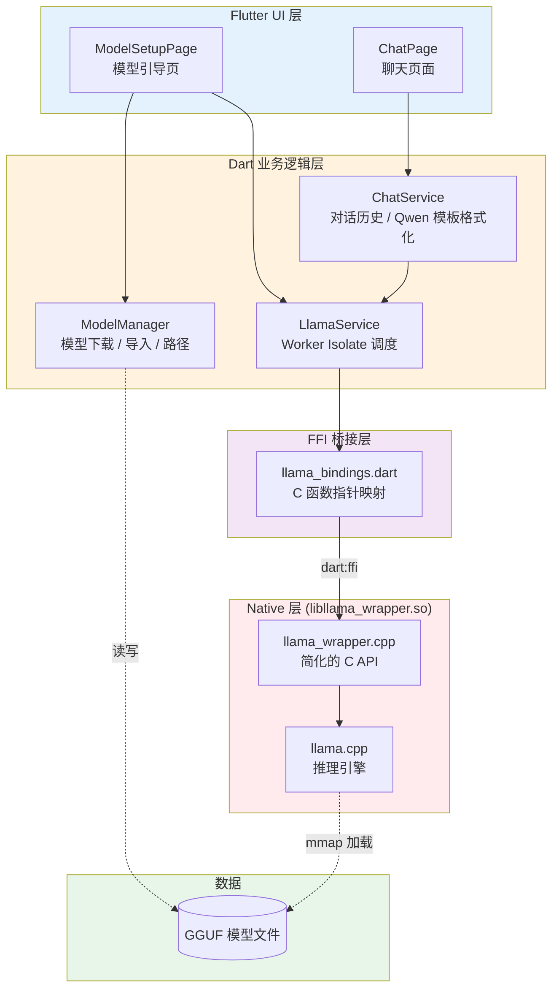
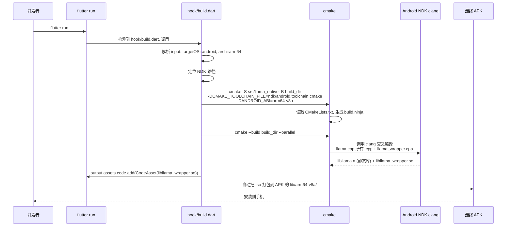
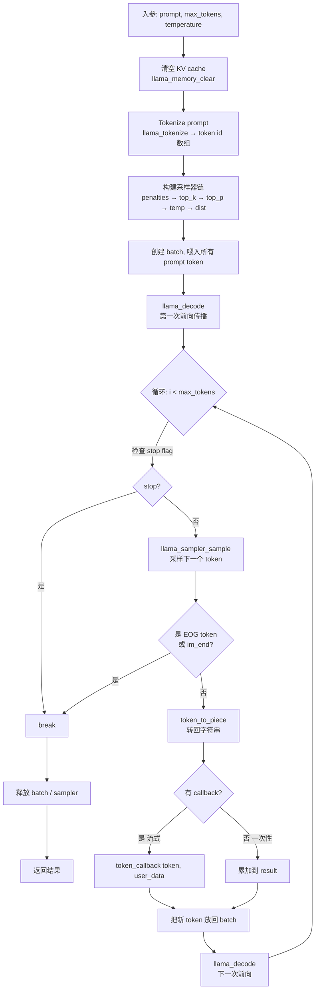
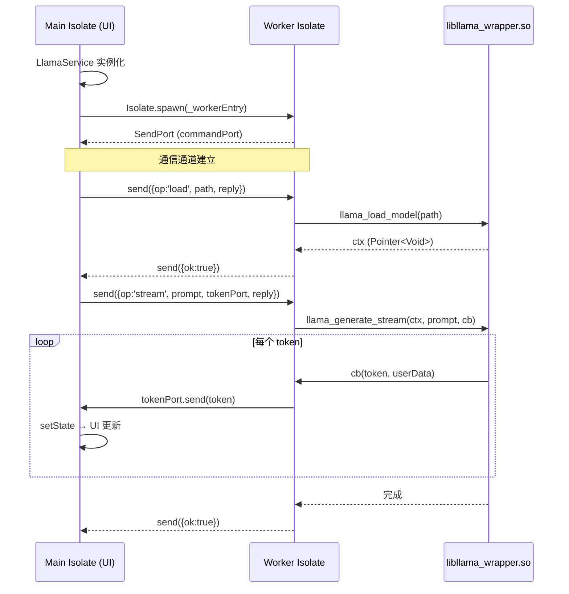
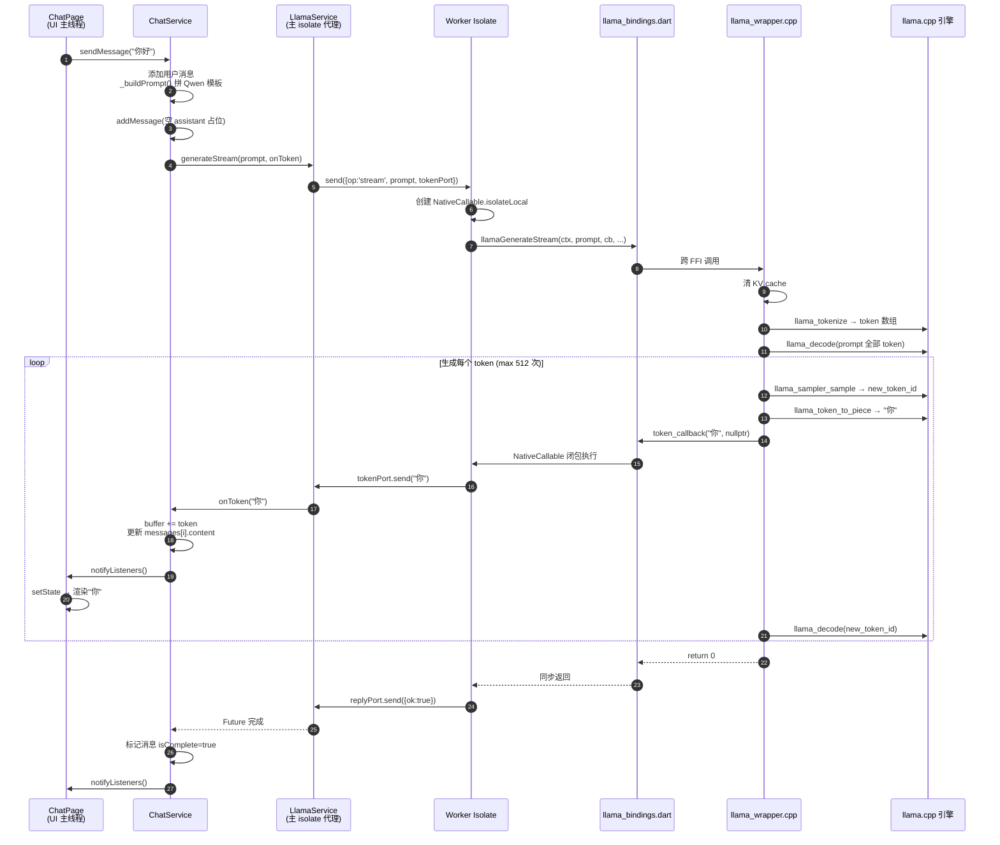

# 如何在端侧实现 LLM 调用

> 本文档基于当前项目（Flutter Module + llama.cpp + Dart Native Assets），讲清楚"在一部手机上跑大模型聊天"这件事从概念到代码的完整链路。
>
> 阅读对象：对 Flutter / Android / C++ 有基本概念，但没接触过端侧推理的工程师。

---

## 目录

1. [背景与名词解释](#1-背景与名词解释)
2. [整体架构](#2-整体架构)
3. [构建流程：so 库是怎么生成的](#3-构建流程so-库是怎么生成的)
4. [代码层深度解析](#4-代码层深度解析)
5. [流式生成的完整链路](#5-流式生成的完整链路)
6. [常见问题与扩展](#6-常见问题与扩展)

---

## 1. 背景与名词解释

端侧 LLM 指的是把大语言模型**完全运行在手机本地**，不依赖任何云端 API。要把"几个 GB 的 Transformer 权重"塞进手机并能流畅推理，需要一整套技术栈协作：

### 1.1 GGUF（GPT-Generated Unified Format）

- **是什么**：一种二进制模型文件格式，由 llama.cpp 团队设计，专门用于在 CPU/移动端高效加载大模型。
- **特点**：单文件包含权重 + 元数据 + tokenizer 词表；支持 `q4_0` / `q4_k_m` / `q8_0` 等多种量化精度，把 FP16 权重压缩到 1/4 ~ 1/2 大小。
- **在本项目的作用**：聊天用的 Qwen 模型就是 GGUF 文件，放在手机本地存储里，由 `model_manager.dart` 管理下载/导入路径，最终由 `llama_load_model()` 读入内存。

> 类比：GGUF 之于 LLM，就像 APK 之于 Android 应用 —— 一个自描述、可直接加载的部署产物。

### 1.2 llama.cpp

- **是什么**：一个用 **纯 C/C++ 实现** 的 LLM 推理引擎，最早是为 LLaMA 模型设计的，现在支持几乎所有主流开源模型（Qwen、Mistral、Gemma、Phi、DeepSeek 等）。
- **为什么选它**：
  - 没有 Python / PyTorch 依赖，可以编译成几 MB 的原生库塞进 App
  - 针对 ARM NEON / Apple Metal / x86 AVX 都有手写优化
  - C API 简洁，方便从 Dart / Swift / Kotlin 通过 FFI 调用
- **在本项目的位置**：`src/llama_native/llama.cpp/` 目录（git submodule），被 CMake 当作子工程一起编译成静态库 `libllama.a`，再链接到我们的 wrapper。

### 1.3 FFI（Foreign Function Interface）

- **是什么**：让一种语言直接调用另一种语言函数的机制。Dart 通过 `dart:ffi` 调用 C 函数（不需要经过 MethodChannel）。
- **对比 MethodChannel**：
  | 特性 | FFI | MethodChannel |
  |---|---|---|
  | 调用方向 | Dart ↔ C/C++ | Dart ↔ Kotlin/Swift |
  | 调用成本 | 零拷贝，纳秒级 | 序列化 + 跨线程，毫秒级 |
  | 适用场景 | 高频 / 大数据 / 性能敏感 | 普通业务通信 |
- **在本项目的作用**：每秒几十次的 token 回调走 FFI 才扛得住。`lib/ffi/llama_bindings.dart` 把 C 头文件里的函数签名翻译成 Dart 函数指针。

### 1.4 CMake

- **是什么**：跨平台的 C/C++ 构建系统生成器，读 `CMakeLists.txt`，吐出对应平台的构建脚本（Makefile / Ninja / Xcode）。
- **为什么需要**：llama.cpp 本身就是 CMake 工程，包含上百个源文件、可选后端（CUDA / Metal / Vulkan）、平台条件编译。直接手写 Makefile 不现实。
- **在本项目的作用**：`src/llama_native/CMakeLists.txt` 把 llama.cpp 子工程引进来，再编译我们自己的 wrapper，输出 `libllama_wrapper.so`。

### 1.5 NDK（Native Development Kit）

- **是什么**：Android 官方提供的 C/C++ 交叉编译工具链，包含 clang、sysroot、CMake toolchain 文件。
- **为什么需要**：手机用 ARM64 指令集，开发机一般是 x86_64 / Apple Silicon，必须有交叉编译器才能产出能在手机上跑的 `.so`。
- **在本项目的作用**：`hook/build.dart` 自动定位本机 NDK 路径（通过 `ANDROID_NDK` 环境变量或 `$ANDROID_HOME/ndk/`），把 `android.toolchain.cmake` 喂给 CMake，让它产出 `arm64-v8a` 的 `.so`。

### 1.6 Native Assets（Dart Code Assets）

- **是什么**：Dart 3.x 引入的**新构建机制**，允许 pubspec 包通过 `hook/build.dart` 脚本在构建期编译原生代码，并把产物自动打包到 Flutter App 里。
- **它取代了什么**：传统做法是把 C++ 代码塞进 `android/app/src/main/cpp/`，由 Android Gradle Plugin 调用 NDK 编译。Native Assets 让 **Flutter 模块自己掌控原生编译**，跨平台一致。
- **在本项目的作用**：`hook/build.dart` 是入口；`flutter run` / `flutter build` 时会自动调用它，触发 CMake 编译并通过 `CodeAsset` 把 `.so` 注册到产物里。**Android 工程下完全没有 NDK 配置代码**，所有原生编译都由 Flutter 模块自管。

### 1.7 Isolate

- **是什么**：Dart 的并发模型。每个 Isolate 有独立的内存堆和事件循环，互不阻塞。
- **为什么需要**：llama.cpp 的 `llama_decode()` 是同步阻塞调用，每生成一个 token 要做一次完整的 Transformer 前向传播，几十到几百毫秒。如果在主 Isolate（UI 线程）里调，UI 会卡死。
- **在本项目的作用**：`LlamaService` 启动一个 worker isolate，把所有 FFI 调用都丢进去执行；token 通过 `SendPort` 流回主 isolate 更新 UI。

### 1.8 Tokenizer & KV Cache & Sampler（推理三件套）

- **Tokenizer（分词器）**：把字符串切成模型能理解的 token id 数组，比如 `"你好"` → `[108386, 100256]`。词表存在 GGUF 文件里。
- **KV Cache（键值缓存）**：Transformer 的注意力机制每次都要看历史 token，KV cache 把每层算过的 K/V 矩阵存起来，避免每生成一个新 token 都重算整个历史。`n_ctx=2048` 就是 KV cache 能装下的最大 token 数。
- **Sampler（采样器）**：模型每一步输出的是"下一个 token 在词表里的概率分布"，sampler 决定如何从这个分布里挑一个。本项目用了一条链：`重复惩罚 → top_k=40 → top_p=0.9 → 温度采样 → 随机抽样`。

### 1.9 Pigeon（项目里也用到了）

- **是什么**：Flutter 官方推出的代码生成器，根据 Dart 接口定义文件，自动生成 Flutter ↔ Native（Kotlin/Swift）的类型安全 MethodChannel 代码。
- **在本项目的作用**：用于 Flutter 和 Android 之间传用户信息、设置等**非 LLM 业务数据**（`lib/pigeon/api.dart`）。和 LLM 推理链路是两条独立通道。

---

## 2. 整体架构

### 2.1 分层视图



### 2.2 关键架构决策

| 决策 | 原因 |
|---|---|
| 用 llama.cpp 而不是 ONNX Runtime / MLC | C API 极简，GGUF 生态丰富，量化模型即下即用 |
| Native Assets 而不是 Android NDK Gradle | Flutter 模块自包含，未来加 iOS 无需改 Android 工程 |
| 自封装 wrapper 而不是直接绑定 llama.h | llama.cpp 头文件有上百个函数，wrapper 把"加载/生成/流式/停止"凝练成 7 个函数 |
| Worker Isolate 而不是 async / compute | 模型 context 是 native 指针，得常驻一个 isolate 持有；compute 每次起新 isolate 没法复用 |
| `NativeCallable.isolateLocal` 流式回调 | C++ 回调在 worker 线程同步执行，无需事件循环，最低延迟 |

---

## 3. 构建流程：so 库是怎么生成的

整个构建链路是**全自动的**，开发者只要 `flutter run` 就够了。但理解它内部发生了什么，对调试至关重要。

### 3.1 编译触发时机



### 3.2 关键文件职责

```
module_flutter/
├── hook/
│   └── build.dart                  ← Native Assets 编译入口（Dart 脚本）
├── src/llama_native/
│   ├── CMakeLists.txt              ← 描述如何编译 wrapper + llama.cpp
│   ├── llama_wrapper.h             ← 暴露给 Dart 的 C API 头文件
│   ├── llama_wrapper.cpp           ← wrapper 实现：load / generate / stream / free
│   └── llama.cpp/                  ← git submodule，整个 llama.cpp 工程
└── lib/ffi/
    └── llama_bindings.dart         ← Dart 侧 FFI 绑定，DynamicLibrary.open(...)
```

### 3.3 编译产物

- **`libllama.a`**：llama.cpp 编译出的静态库，约几 MB。
- **`libllama_wrapper.so`**：我们的动态库，把 `libllama.a` **静态链接** 进去，最终 App 里只暴露这一个 `.so`。
- **打包位置**：Flutter Native Assets 自动放入 APK 的 `lib/arm64-v8a/libllama_wrapper.so`。

### 3.4 增量构建

`hook/build.dart:48` 有一段：

```dart
// 增量构建：已编译则直接复用
if (expectedLib != null && await expectedLib.exists()) {
  return expectedLib;
}
```

只要 `.so` 还在 `outputDirectory` 里就跳过编译。**改 C++ 代码后想重编**，删 `.dart_tool/hooks_runner/` 下对应的 `build_android_arm64/` 目录即可。

---

## 4. 代码层深度解析

### 4.1 `src/llama_native/CMakeLists.txt`

这是整个原生编译的核心配置。

```cmake
cmake_minimum_required(VERSION 3.22.1)
project("llama_wrapper")

set(CMAKE_CXX_STANDARD 17)

# 把 llama.cpp 作为子工程加载
set(LLAMA_DIR ${CMAKE_SOURCE_DIR}/llama.cpp)

# 关键开关：让 llama.cpp 编译成静态库而不是动态库
set(BUILD_SHARED_LIBS OFF CACHE BOOL "" FORCE)

# 关掉 llama.cpp 自带的 tests / examples / server，加快编译
set(LLAMA_BUILD_TESTS    OFF CACHE BOOL "" FORCE)
set(LLAMA_BUILD_EXAMPLES OFF CACHE BOOL "" FORCE)
set(LLAMA_BUILD_SERVER   OFF CACHE BOOL "" FORCE)

# Android 上 OpenMP 会引入 libomp.so 依赖，强制关掉
set(GGML_OPENMP OFF CACHE BOOL "" FORCE)

add_subdirectory(${LLAMA_DIR} llama_build)

# 我们的 wrapper：编译成动态库
add_library(llama_wrapper SHARED llama_wrapper.cpp)

# 链接 llama 静态库 + Android 系统库（log、JNI 等）
target_link_libraries(llama_wrapper llama android log)

# 让 wrapper 能 #include <llama.h>
target_include_directories(llama_wrapper PRIVATE
    ${LLAMA_DIR}/include
    ${LLAMA_DIR}/ggml/include
    ${LLAMA_DIR}/src
)
```

**做的事**：
1. 把第三方 llama.cpp 当库引入；
2. 关掉无关组件，避免编译失败和体积膨胀；
3. 编译 `llama_wrapper.cpp` 成 SHARED 库；
4. 静态链接 llama，最终只输出一个 `libllama_wrapper.so`。

### 4.2 `llama_wrapper.h`：暴露给 Dart 的 C API

```c
extern "C" {
  void  llama_backend_init_wrapper(void);                                   // 初始化后端
  void* llama_load_model(const char* model_path);                            // 加载 GGUF
  int   llama_generate(void* ctx, const char* prompt,
                       char* output, int size, int max_tokens, float temp);  // 一次性生成
  int   llama_generate_stream(void* ctx, const char* prompt,
                              void (*cb)(const char*, void*),
                              void* user_data, int max_tokens, float temp);  // 流式生成
  int   llama_chat(...);                                                     // 别名 generate
  void  llama_wrapper_free(void* ctx);                                       // 释放
  void  llama_set_stop_flag(int flag);                                       // 中断
  const char* llama_get_last_error(void);                                    // 错误信息
}
```

**为什么用 `extern "C"`**：禁掉 C++ name mangling，否则 Dart FFI 通过函数名查不到符号。

**为什么用 `void*` 表示 context**：Dart 不需要知道 C++ 类的内部结构，把 `llama_context*` 退化成不透明指针就够了 —— 这是 FFI 设计的经典手法。

### 4.3 `llama_wrapper.cpp`：核心实现

文件不长（约 300 行），分三块：

#### 4.3.1 模型加载（`llama_load_model`）

```cpp
void* llama_load_model(const char* model_path) {
    llama_backend_init_wrapper();                          // 全局初始化（仅一次）

    llama_model_params  model_params = llama_model_default_params();
    llama_model*        model = llama_model_load_from_file(model_path, model_params);

    llama_context_params ctx_params = llama_context_default_params();
    ctx_params.n_ctx    = 2048;    // 上下文窗口大小
    ctx_params.n_batch  = 512;     // 单次最多处理多少 token
    ctx_params.n_ubatch = 512;

    llama_context* ctx = llama_init_from_model(model, ctx_params);
    return ctx;                    // 退化成 void* 返给 Dart
}
```

`n_ctx=2048` 是个折中：太大 KV cache 占内存，太小记不住对话历史。`ChatService` 里 `_truncateHistory()` 就是为了不撞这条线。

#### 4.3.2 生成（`generate_internal` 是核心）

所有生成（`llama_generate` / `llama_generate_stream` / `llama_chat`）最终都走到 `generate_internal`。流程：



**采样器链的设计**（`llama_wrapper.cpp:141-160`）：

```cpp
llama_sampler* sampler = llama_sampler_chain_init(...);
llama_sampler_chain_add(sampler, llama_sampler_init_penalties(64, 1.10f, 0.0f, 0.0f));
//                                                            ↑    ↑
//                                                  最近 64 token 重复惩罚 1.1
llama_sampler_chain_add(sampler, llama_sampler_init_top_k(40));   // 只看 top 40
llama_sampler_chain_add(sampler, llama_sampler_init_top_p(0.9f, 1)); // 累计概率 ≤ 0.9
llama_sampler_chain_add(sampler, llama_sampler_init_temp(temperature)); // 温度
llama_sampler_chain_add(sampler, llama_sampler_init_dist(SEED));  // 最后随机抽
```

重复惩罚是**实战中最容易忽略的一环**。没有它，模型很容易陷入"你好你好你好你好..."的循环。

**手动截断 Qwen 终止符**（`llama_wrapper.cpp:213-217`）：

```cpp
if (token_str.find("<|im_end|>")    != std::string::npos ||
    token_str.find("<|im_start|>")  != std::string::npos ||
    token_str.find("<|endoftext|>") != std::string::npos) {
    break;   // 模型试图开启下一轮对话，立刻停下
}
```

llama.cpp 的 `llama_vocab_is_eog()` 不一定能识别所有模型的特殊 token，**手动兜一道更稳**。

#### 4.3.3 中断（`llama_set_stop_flag`）

```cpp
static std::atomic<bool> g_stop_flag{false};

void llama_set_stop_flag(int flag) {
    g_stop_flag.store(flag != 0);
}

// 在 for 循环里检查:
if (g_stop_flag.load()) break;
```

用 atomic 是因为 Dart 主 isolate 调 `llama_set_stop_flag(1)` 时，worker isolate 正在执行 `generate_internal` —— **跨线程访问必须 atomic**。

### 4.4 `lib/ffi/llama_bindings.dart`：Dart 侧绑定

把每个 C 函数翻译成 Dart 函数指针，三步走：

```dart
// 1) 定义两个 typedef：C 签名 + Dart 签名
typedef LLamaLoadModelC    = Pointer<Void> Function(Pointer<Utf8>);
typedef LLamaLoadModelDart = Pointer<Void> Function(Pointer<Utf8>);

// 2) 打开 .so 文件（Dart 自动到 lib/arm64-v8a/ 找）
final _lib = DynamicLibrary.open('libllama_wrapper.so');

// 3) 用函数名查符号，转成可调用的 Dart 函数
final llamaLoadModel = _lib
    .lookup<NativeFunction<LLamaLoadModelC>>('llama_load_model')
    .asFunction<LLamaLoadModelDart>();
```

之后在业务代码里 `llamaLoadModel(pathPtr)` 就和调普通 Dart 函数一样。

**字符串怎么传**：Dart 的 `String` 是 UTF-16，C 要 UTF-8 + null 结尾，所以全程要 `prompt.toNativeUtf8()` 转换，用完 `calloc.free(ptr)` 释放，否则**会内存泄漏**（FFI 的内存不归 Dart GC 管）。

### 4.5 `lib/services/llama_service.dart`：Worker Isolate 调度

为什么不能在主 isolate 直接调 FFI？因为 `llama_decode()` 一次几十毫秒，UI 会卡。所以：



**几个关键细节**：

1. **`_ensureWorker()`**（`llama_service.dart:20`）：worker 是惰性创建的，第一次调用时才起 isolate。
2. **`SendPort` 不能跨 isolate 直接传指针**：所以 ctx (Pointer<Void>) 始终在 worker 里持有，主 isolate 只持有 `commandPort`。
3. **流式回调用两个 Port**：
   - `replyPort`：等待整体完成的应答（单次消息）
   - `tokenPort`：每个 token 一条消息，主 isolate 监听更新 UI

### 4.6 `NativeCallable.isolateLocal` 流式回调原理

最有意思的是这一段（`llama_service.dart:286-290`）：

```dart
final callback = NativeCallable<TokenCallbackC>.isolateLocal(
    (Pointer<Utf8> token, Pointer<Void> userData) {
        tokenPort.send(token.toDartString());   // ← 这是 Dart 代码！
    },
);

llamaGenerateStream(ctx, promptPtr, callback.nativeFunction, ...);
```

发生了什么：

- `NativeCallable.isolateLocal` 把一个 **Dart 闭包** 包装成一个 **C 函数指针**。
- 当 C++ 那边调 `token_callback(token_str.c_str(), ...)` 时，实际跳转回 Dart 运行时执行那个闭包。
- `isolateLocal` 表示这个回调**只在当前 worker isolate 同步执行**，不需要把消息发回 Dart 事件循环再调度 —— 延迟最低、最简单。
- C++ 那边是**同步**调的：每生成一个 token 就阻塞调一次 callback，callback 返回后才继续下一轮 `llama_decode`。所以 `tokenPort.send()` 本质是**异步通知主 isolate**，不阻塞 worker 自己的生成节奏。

> 老式 FFI 实现要用 `dart:ffi` + `dart:isolate` 手搓 NativePort，现在 `NativeCallable` 一行搞定。

---

## 5. 流式生成的完整链路

把前面所有内容串起来，跟踪用户在聊天框敲下一个问题 → 看到逐字显示的回复 的整个过程。



### 关键时序点解释

| 步骤 | 含义 | 易错点 |
|---|---|---|
| ② Qwen 模板拼接 | 把对话历史按 `<\|im_start\|>...<\|im_end\|>` 包起来 | 缺最后一行 `<\|im_start\|>assistant\n` 模型不知道该自己说话 |
| ⑦ 清 KV cache | 每次新对话从头算，避免上次的状态污染 | 不清会导致输出错乱 |
| ⑪ token_callback 同步 | C++ 阻塞等回调返回 | callback 里千万别做耗时操作 |
| ⑫-⑬ tokenPort.send | 跨 isolate 异步通知 | 不阻塞 worker 节奏 |
| ⑮ notifyListeners | ChangeNotifier 触发重建 | 高频调用注意 widget 重建范围 |

---

## 6. 常见问题与扩展

### 6.1 为什么不用 MethodChannel 传 token？

每秒几十次的 token 流量，MethodChannel 需要 JSON 序列化 + 跨平台通道编解码，延迟会从微秒级飙到毫秒级，UI 流式效果会断断续续。FFI + NativeCallable 是这个场景的标准答案。

### 6.2 模型放哪？为什么不打包进 APK？

- 量化后的 Qwen 也有几百 MB 到 1 GB，打进 APK 一是 Google Play 限制 200 MB（虽然能用 Asset Pack 绕开），二是更新模型就要更新整个 App。
- 本项目让用户**首次启动时下载**或**通过 file_picker 导入**（见 `model_manager.dart`），存到 `getApplicationDocumentsDirectory()/models/`。

### 6.3 想换成 iOS 怎么办？

理论上几乎不用改：

1. `hook/build.dart` 已经处理了 iOS 分支（`-DCMAKE_SYSTEM_NAME=iOS`）；
2. CMake 会输出 `libllama_wrapper.dylib`；
3. `llama_bindings.dart` 已经按平台自动选库名。

要做的：
- 移除 `CMakeLists.txt` 里 `android log` 库的链接（iOS 上没有）；
- iOS 工程开 Native Assets 支持；
- 实测 Metal 后端能不能编进来（llama.cpp 原生支持 Apple Metal，是 iOS 上的最优选）。

### 6.4 想接其他模型（比如 Llama-3、DeepSeek）？

- 只要是 **GGUF 格式**就能直接用，换文件即可；
- 但 **chat template 不一样**：Llama-3 用 `<|begin_of_text|><|start_header_id|>user<|end_header_id|>...`，要改 `ChatService._buildPrompt()` 和 `llama_wrapper.cpp:213` 的终止符判断；
- 上下文窗口可能不同，调整 `n_ctx`。

### 6.5 性能调优方向

| 维度 | 怎么调 |
|---|---|
| 上下文窗口 | `n_ctx` 越大 KV cache 越大，看模型支持的上限和手机内存 |
| 批处理 | `n_batch` 影响首 token 延迟，512 是经验值 |
| 量化等级 | `q4_k_m` 是质量/体积平衡点；`q8_0` 更准但大一倍 |
| 多线程 | llama.cpp 默认按 CPU 核心数开线程，无需手动调 |
| GPU | Android 上可启用 OpenCL/Vulkan 后端（当前未启用） |

---

## 附录：调试技巧

1. **看 native log**：`adb logcat | grep LLAMA_WRAPPER`，C++ 里所有 `LOGI` / `LOGD` 都在这。
2. **看 Dart 侧 prompt**：`ChatService.sendMessage` 用 `LogByLLM.d` 打印了完整 prompt 和每个 token，调模板时很有用。
3. **so 没生成**：删 `.dart_tool/hooks_runner/` 重新 `flutter run`，看 hook 的报错。
4. **找不到 NDK**：`export ANDROID_NDK=/path/to/ndk` 或者把 NDK 装到 `$ANDROID_HOME/ndk/27.x.x/`。
5. **模型加载失败**：先看文件大小是否 > 1 MB（`model_manager.dart` 的校验门槛），再看 `llama_get_last_error()` 返回的字符串。

---

**完。** 有进一步问题（比如要扩展到工具调用、RAG、量化训练等），可以基于本文档继续延伸。
